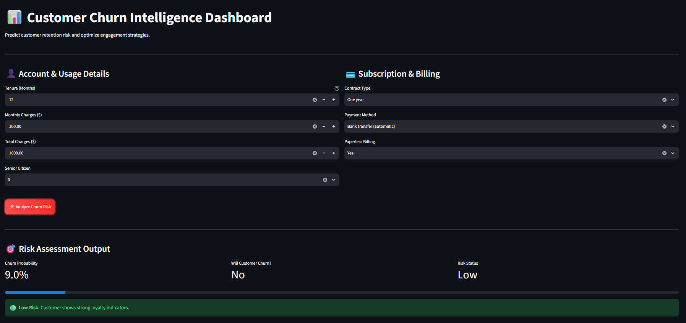

# Customer Churn MLOps

An end-to-end Machine Learning pipeline and web application designed to predict customer churn.

### 📸 Web Application Preview

## Project Structure
* `01_eda_and_preprocessing.py`: Data exploration and cleaning pipeline.
* `preprocessing.py`: Feature engineering scripts.
* `train.py`: Model training and evaluation.
* `main.py`: Entry point for pipeline execution.
* `app/streamlit_app.py`: Streamlit web UI for interactive predictions.

## Local Setup

1. **Clone the repository:**
   
   git clone https://github.com/gopals09920/Customer-churn-mlops.git
   cd Customer-churn-mlops